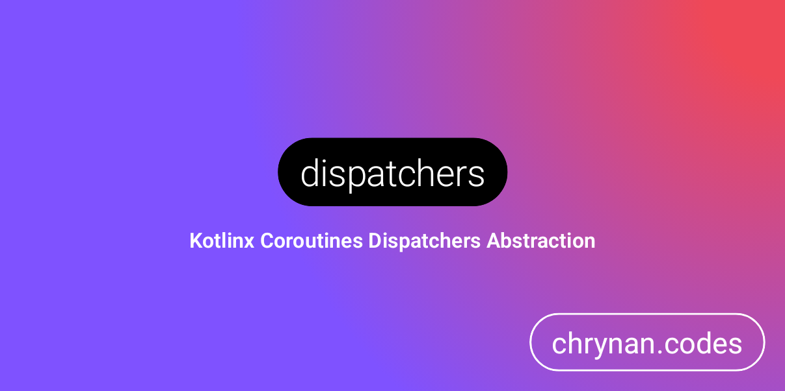

# dispatchers

A simple Kotlin multi-platform wrapper around the Kotlin Coroutine Dispatchers object. Providing fall backs when a
CoroutineDispatcher isn't available for a target platform. <br/><br/>


```kotlin
withContext(Dispatchers.IO) { ... }
```

## Getting Started 🏁

The library is provided through [Repsy](https://repsy.io). Refer to
the [releases](https://github.com/chRyNaN/dispatchers/releases) for the latest version. <br/>


### Repository

```groovy
repositories {
    maven { url "https://repo.repsy.io/mvn/chrynan/public" }
}
```

### Dependencies

```groovy
implementation "com.chrynan.dispatchers:dispatchers:$VERSION"
```

## Usage 👨‍💻

This library provides a `Dispatchers.IO` property in the common source set. Simply use that, or if needed, you can
access all the `CoroutineDispatchers` via the `dispatchers` top-level object. Then use the available dispatchers:

```kotlin
launch(dispatchers.main) {
    withContext(dispatchers.io) { ... }
    withContext(dispatchers.default) { ... }
    withContext(dispatchers.unconfined) { ... }
    withContext(dispatchers.ui) { ... }
}
```

Since `CoroutineDispatchers` is an interface, it is easy to create an implementation or mock the component for testing
purposes.

## Documentation 📃

Have a look at the [docs folder](docs) for documentation and more information about usage.

## Security 🛡️

For security vulnerabilities, concerns, or issues, please responsibly disclose the information either by opening a
public GitHub Issue or reaching out to the project owner.

## Contributing ✍️

Outside contributions are welcome for this project. Please follow the [code of conduct](CODE_OF_CONDUCT.md)
and [coding conventions](CODING_CONVENTIONS.md) when contributing. If contributing code, please add thorough documents.
and tests. Thank you!

## Sponsorship ❤️

Support this project by [becoming a sponsor](https://www.buymeacoffee.com/chrynan) of my work! And make sure to give the
repository a ⭐

## License ⚖️

```
Copyright 2021 chRyNaN

Licensed under the Apache License, Version 2.0 (the "License");
you may not use this file except in compliance with the License.
You may obtain a copy of the License at

   http://www.apache.org/licenses/LICENSE-2.0

Unless required by applicable law or agreed to in writing, software
distributed under the License is distributed on an "AS IS" BASIS,
WITHOUT WARRANTIES OR CONDITIONS OF ANY KIND, either express or implied.
See the License for the specific language governing permissions and
limitations under the License.
```
